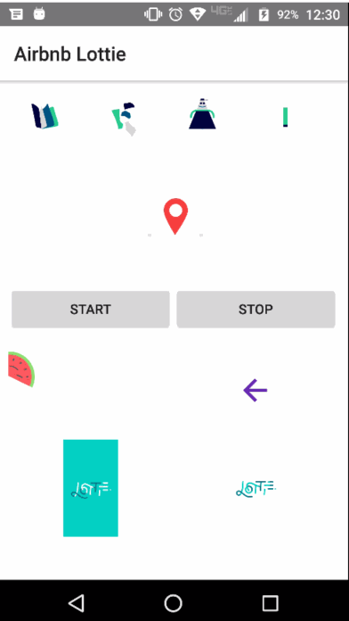

# NativeScript-Lottie
NativeScript plugin to expose Airbnb Lottie for awesome animations.

[](https://www.npmjs.com/package/nativescript-lottie)
[](https://www.npmjs.com/package/nativescript-lottie)


Uses [Airbnb Lottie](https://github.com/airbnb/lottie-android) for Android and [iOS Lottie](https://github.com/airbnb/lottie-ios) for iOS.

## Demo Screen
_The .gif does not do the fluid animations justice_



## Contributors
[Nathank Walker](https://github.com/NathanWalker) - thanks for handling the iOS piece :thumbsup:

## License
This plugin is licensed under the MITlicense by Brad Martin

## Installation
To install type

```
tns plugin add nativescript-lottie
```

## Notice

There is a current issue open on the NativeScript Android runtime [repo here](https://github.com/NativeScript/android-runtime/issues/700) 
to  determine the correct approach on placing the files in `assets` for the native library to find the file using Android's `getAssets()` method.
There are ways to hack around this but right now I don't have the time, so you have to run a build and then move your animation .json files into `platforms/android/src/main/assets`
for this to work. Then you can execute `tns run android` and the files will transfer to your device/emulator. Hopefully a solution comes along soon without
this approach as it's not the simplest for beginner NativeScript devs without much Android knowledge. There are some sample animation files in the `sample-effects` folder taken from the Airbnb repo.

I've not setup the propertyChange events for `loop`, `autoPlay` or `src`. Will accept a PR if someone wants to provide the capability of changing properties of the LottieView instance after initial load.

### XML
```xml
<Page 
    xmlns="http://schemas.nativescript.org/tns.xsd" 
    xmlns:Lottie="nativescript-lottie" navigatingTo="navigatingTo" class="page">
    <StackLayout>
        <Lottie:LottieView src="PinJump.json" height="130" loop="true" autoPlay="true" loaded="yourLoadedEvent" />
    </StackLayout>
</Page>
```

### TS
```TS
import { LottieView } from "nativescript-lottie";

public yourLoadedEvent(args) {
    this._myLottie: LottieView = args.object; /// this is the instance of the LottieAnimationView
}
```


## Methods

- `startAnimation()` - starts the animation for the LottieView instance.
- `cancelAnimation()` - pauses the animation for the LottieView instance.
- `isAnimating()` - returns true if the LottieView is animating, else false.

## Properties

- `autoPlay: boolean` - set true and the LottieView will start animating when it loads.
- `loop: boolean` - set true to continuously loop the animation.
- `src: string` - the .json file for the animation.

