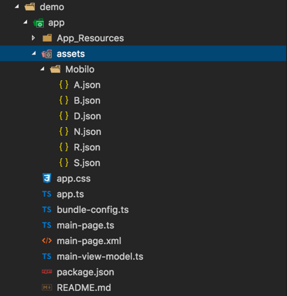
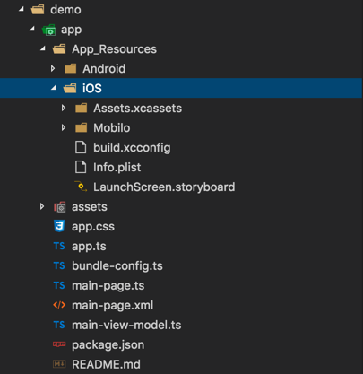

# NativeScript-Lottie

NativeScript plugin to expose Airbnb Lottie for awesome animations.

[](https://www.npmjs.com/package/nativescript-lottie)
[](https://www.npmjs.com/package/nativescript-lottie)

Uses [Airbnb Lottie](https://github.com/airbnb/lottie-android) for Android and [iOS Lottie](https://github.com/airbnb/lottie-ios) for iOS.

## Demo Screen

_The .gif does not do the fluid animations justice_


## Installation

To install execute:

```
tns plugin add nativescript-lottie
```
# Usage

## Plain {N}

### XML 

```xml
<Page
    xmlns="http://schemas.nativescript.org/tns.xsd"
    xmlns:Lottie="nativescript-lottie" navigatingTo="navigatingTo" class="page">
    <StackLayout>
        <Lottie:LottieView src="PinJump.json" height="130" loop="true" autoPlay="true" loaded="yourLoadedEvent" />
    </StackLayout>
</Page>
```

### TS

```TS
import { LottieView } from "nativescript-lottie";

public yourLoadedEvent(args) {
    this._myLottie: LottieView = args.object; /// this is the instance of the LottieAnimationView
}
```

## {N} with Angular

### XML

```xml
<StackLayout>
    <LottieView width="100" height="150" [src]="src" [loop]="loop" [autoPlay]="autoPlay" (loaded)="lottieViewLoaded($event)">     </LottieView>
</StackLayout>
```
### Component

```typescript
import { Component } from "@angular/core";
import { registerElement } from 'nativescript-angular';
import { LottieView } from 'nativescript-lottie';

registerElement('LottieView', () => LottieView);

@Component({
    templateUrl: "home.component.html",
    moduleId: module.id
})
export class HomeComponent {

    public loop: boolean = true;
    public src: string;
    public autoPlay: boolean = true;
    public animations: Array<string>;

    private _lottieView: LottieView;
    
    constructor() {
        this.animations = [
            "Mobilo/A.json",
            "Mobilo/D.json",
            "Mobilo/N.json",
            "Mobilo/S.json"
        ];
        this.src = this.animations[0];
    }

    lottieViewLoaded(event) {
        this._lottieView = <LottieView>event.object;
    }
}
```
## Assets

:warning: This plugin uses the [nativescript-dev-assets](https://github.com/rhanb/nativescript-dev-assets) hook to sync the `assets` files for Android to avoid the following [issue](https://github.com/NativeScript/android-runtime/issues/700).

:fire: You can find animations in the `sample-effects` folder.

### Android

Place your animations files in your `app/assets` folder.



### iOS

Place your animations files in your `app/App_Resources/iOS/` folder.



## Properties

| Property | Type | Default | Description |
| --- | --- | --- | --- |
| `autoPlay` | `boolean` | `false` | Start LottieView animation on load if `true`. |
| `loop` | `boolean` | `false` | Loop continuously animation if `true`. |
| `src` | `string` | `null` | Animation path to ` .json` file. |

## Methods

| Method | Return | Parameters | Description | 
| --- | --- | --- | --- | 
| `startAnimation` | `void`| None | Starts the animation for the LottieView instance. |
| `cancelAnimation` | `void`| None | Pauses the animation for the LottieView instance. |
| `isAnimating` | `boolean`| None | Returns true if the LottieView is animating, else false. |

## Contributors

[](https://github.com/bradmartin) | [](https://github.com/NathanWalker/) | [](https://github.com/rhanb)|
:---: |:---: |:---:|
[bradmartin](https://github.com/bradmartin)|[NathanWalker](https://github.com/NathanWalker) |[rhanb](https://github.com/rhanb) |

